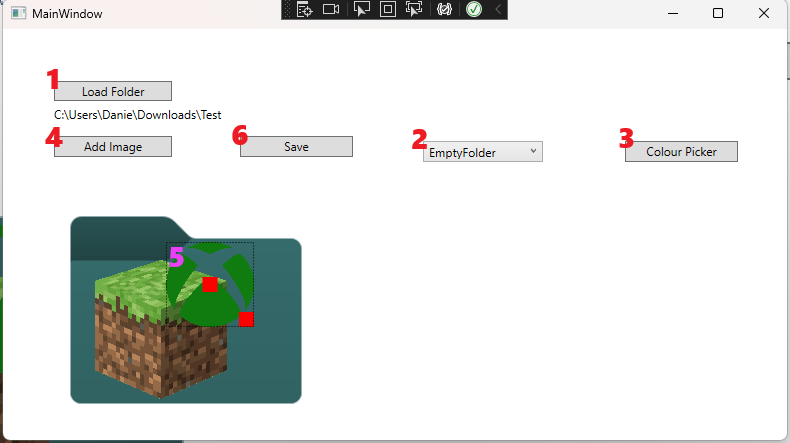

# User Guide:

## Video Demonstration:

- https://youtu.be/41PahQDnqHk

## Controls

1. First, click "Load Folder" and navigate to the folder who's icon you wish to customise

2. Next, use the dropdown to select the base icon you wish to use

3. Click Colour Picker to select the colour you wish the base icon to be

4. Click Add Image to add any images you wish to the icon (can be repeated to add multiple)

5. Hover over the image to:
    - Move the image - by clicking in the centre square and dragging
    - Resize the image - by clicking in the bottom right square and dragging
    - Delete the image - by pressing the delete key whilst hovering

6. Clicking Save will now save the icon to the folder

## Developer Information

- Created a C# DotNet WPF GUI Application which allows users to customise specific folder's icons

- Works by converting the contents of the Canvas into a .ico then referencing it in the desktop.ini for that folder

- Utilizes custom editableImageCanvas to allow user to resize, move, and delete images within