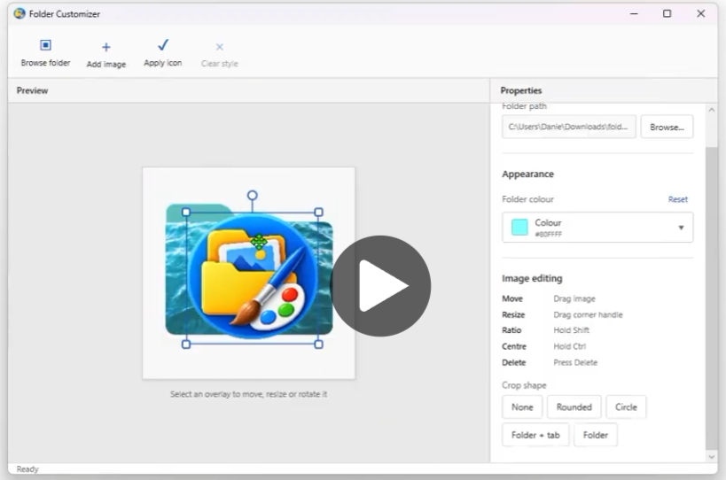
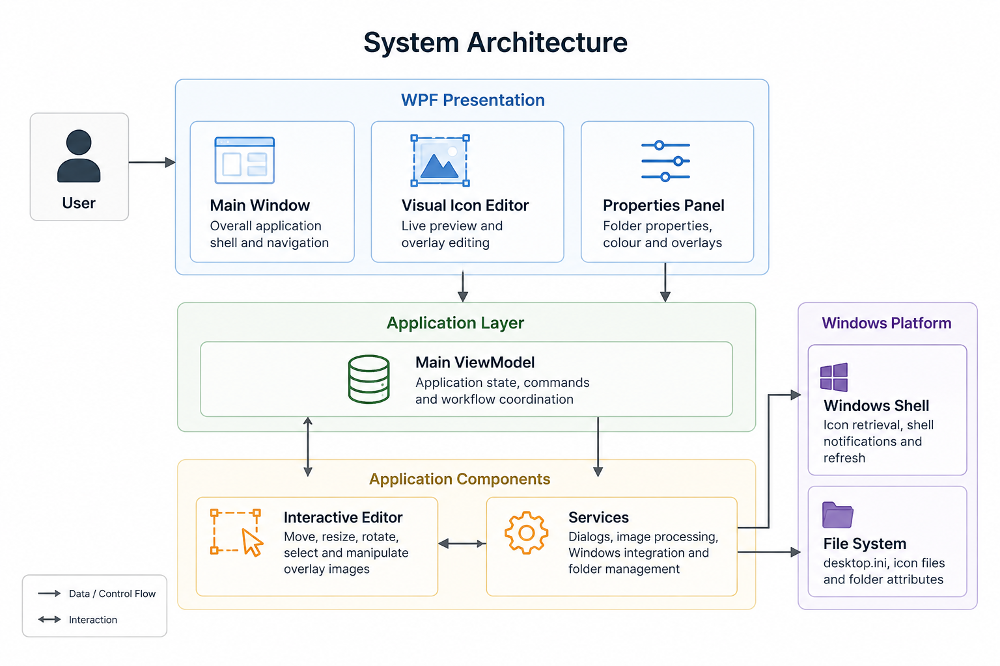
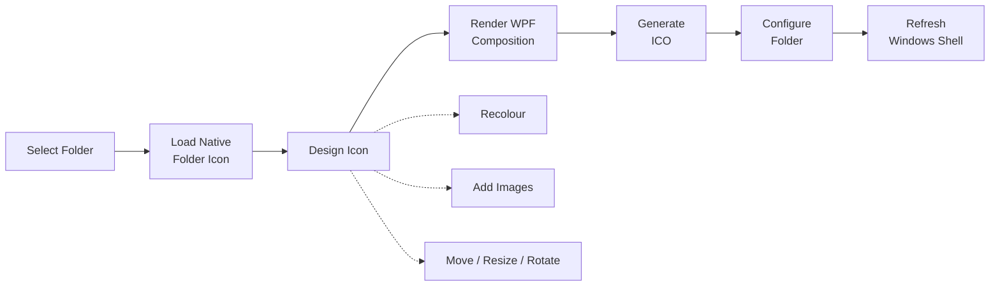

# Folder Customizer

A Windows desktop application for visually designing and applying custom folder icons.

Folder Customizer provides a simple graphical editor for recolouring the native Windows folder icon and compositing custom image overlays. Users can move, resize, and rotate overlays before applying the finished design directly to a folder in File Explorer.

Behind the editor, the application handles native Windows Shell integration, bitmap processing, ICO generation, file-system metadata, and WPF rendering.

## Demo
[](https://youtu.be/4Tca0lsZU-c)

## Key Features

- 🎨 **Folder recolouring** — recolour the native Windows folder icon while preserving its original highlights and shading.
- 🖼️ **Image overlays** — add PNG and JPEG artwork to create custom folder designs.
- 🖱️ **Interactive editor** — move, resize, rotate, select, and delete overlays directly on the preview.
- ⌨️ **Precision controls** — preserve aspect ratio, resize from centre, snap rotation, and nudge overlays using keyboard modifiers.
- 👁️ **Live preview** — preview the complete composition before applying it.
- 🪟 **Native Windows integration** — apply icons using Windows' standard folder customisation mechanism.
- 🔄 **Style management** — detect and remove previously applied Folder Customizer styles.

---

## Technical Highlights

| Area | Implementation |
|---|---|
| **Platform** | C# / .NET / WPF |
| **Architecture** | MVVM-oriented architecture using `CommunityToolkit.Mvvm` |
| **Native Integration** | Windows Shell APIs through P/Invoke |
| **Image Editing** | Custom WPF overlay editor with dragging, resizing and rotation |
| **Image Processing** | Direct bitmap back-buffer manipulation |
| **Rendering** | WPF visual-tree rendering with `RenderTargetBitmap` |
| **Icon Generation** | Custom PNG → ICO encoding pipeline |
| **Folder Integration** | `desktop.ini`, file attributes and Shell notifications |

### What makes the project technically interesting?

Folder customisation looks simple from a user's perspective, but Windows does not provide a straightforward managed API for the complete process.

Folder Customizer bridges several different layers of the Windows platform:

- Native Shell APIs are accessed through **P/Invoke** to retrieve system icons and refresh Explorer.
- Native icon handles are converted into WPF images and explicitly released.
- Folder colours are generated using **direct per-pixel bitmap processing** rather than simple UI tinting.
- The interactive image editor implements its own **dragging, resizing, rotation, hit testing, mouse capture, and keyboard interaction**.
- Completed compositions are rendered from the WPF visual tree and passed through a **custom ICO generation pipeline**.
- Persistent folder icons are applied using Windows' `desktop.ini` mechanism and the required file-system attributes.

This allows the application to present a straightforward visual editor while hiding the lower-level Windows integration required underneath.

---

## Architecture

Folder Customizer uses an **MVVM-oriented architecture** with a deliberate separation between application state, visual interaction, and operating-system integration.



### Presentation

The WPF presentation layer provides the application shell, properties panel, and live 256×256 icon editor.

### Application State

`MainViewModel` acts as the central coordinator for editor state and application workflows. It manages the selected folder, colour, image overlays, commands, preview state, and final icon-application process.

### Interactive Editor

Direct manipulation is handled by a specialised WPF editor control.

Operations such as dragging, resizing, rotation, mouse capture, hit testing, and visual-tree rendering remain in the presentation layer because they depend directly on WPF visual state.

The underlying overlay position, dimensions, rotation, and selection state remain represented by view models.

### Services

Platform-specific functionality is isolated behind dedicated services responsible for:

- Folder and image selection
- Colour selection
- Bitmap processing
- Native Windows folder icon retrieval
- Custom folder icon management
- Windows Shell integration

This keeps the application's core state management separate from operating-system-specific implementation details.

---

## How It Works


```mermaid
flowchart LR
    A["Select Folder"] --> B["Load Native<br/>Folder Icon"]
    B --> C["Design Icon"]
    C --> D["Render WPF<br/>Composition"]
    D --> E["Generate<br/>ICO"]
    E --> F["Configure<br/>Folder"]
    F --> G["Refresh<br/>Windows Shell"]

    C -.-> C1["Recolour"]
    C -.-> C2["Add Images"]
    C -.-> C3["Move / Resize / Rotate"]
```

### 1. Load the folder

The user selects a target folder and Folder Customizer retrieves the appropriate folder artwork from the Windows Shell.

If the folder was previously customised by the application, its existing style can also be detected and removed.

### 2. Design the icon

The native folder artwork becomes the base of a live WPF editing surface.

Users can recolour it and add multiple image overlays. Each overlay can be independently positioned, resized, and rotated.

### 3. Render the composition

When the user applies the icon, editor-only elements such as selection borders and resize handles are temporarily hidden.

The completed WPF visual tree is then rendered to a transparent PNG.

### 4. Generate the Windows icon

The rendered image is converted into a Windows-compatible `.ico` file using the application's own lightweight ICO generation pipeline.

### 5. Apply it to Windows

Folder Customizer generates the required `desktop.ini` configuration, updates the folder and file attributes expected by Windows, and notifies the Windows Shell that the folder has changed.

File Explorer then handles displaying the customised icon.

---

## Windows & Image Processing

Two areas contain most of the project's lower-level implementation complexity.

### Windows Shell Integration

Folder Customizer deliberately uses Windows' native folder customisation system rather than introducing a proprietary format.

The application interacts with native Windows APIs to:

- Retrieve the folder icon supplied by the current Windows installation.
- Access high-resolution Shell icon resources.
- Convert native icon handles into WPF-compatible images.
- Notify the Windows Shell when folder customisation changes.

Persistent icons are applied through `desktop.ini` together with the file and folder attributes required by Windows Explorer.

Because unmanaged Windows resources are involved, native handles are explicitly managed and released after use.

### Bitmap Processing & Icon Generation

Folder recolouring operates directly on bitmap pixel data.

Rather than applying a flat colour overlay, the processor calculates the luminance of each source pixel and combines it with the selected colour. This retains the highlights, shadows, and visual depth of the original Windows folder artwork.

The final composition follows this pipeline:

**WPF visual tree → rendered PNG → ICO encoding → Windows folder icon**

The application writes the ICO structure itself and embeds the rendered PNG data inside it, avoiding the need for an external image-conversion dependency.

---

## Interactive Editor

The overlay editor is implemented as a custom WPF control rather than relying on a pre-built image editing component.

It supports:

- Dragging and positioning
- Four-corner resizing
- Aspect-ratio-preserving resizing
- Centre-based resizing
- Free rotation
- 15° rotation snapping
- Keyboard nudging
- Selection and deletion
- Enlarged manipulation hit areas
- Mouse capture during transformations

Resize calculations also account for image rotation by translating pointer movement between editor and local image coordinate systems.

The editor separates the **visual manipulation controls** from the **underlying overlay state**, allowing the interaction layer to remain WPF-specific while editor state remains represented by view models.

---

## Design Decisions

### Pragmatic MVVM

The project follows MVVM where it provides useful separation rather than enforcing it rigidly.

Application state and workflows belong to view models, while operations that fundamentally require access to WPF's visual tree remain within the view layer.

For example, rendering the finished icon must operate on the actual composed WPF visual tree. The view model therefore requests a render, while the editor view performs it.

This prevents WPF controls and rendering concerns from leaking into application state.

### Native rather than simulated Windows integration

The application retrieves Windows' actual folder artwork instead of bundling its own approximation and uses Windows' standard folder customisation mechanism when applying the result.

This keeps the generated folders compatible with File Explorer without requiring Folder Customizer to remain running.

### Minimal external dependencies

Core functionality such as bitmap recolouring and ICO generation is implemented within the project rather than delegated to large image-processing libraries.

---

## Project Structure

```text
FolderCustomizer/
│
├── Editor/
│   └── Interactive image manipulation
│
├── Services/
│   └── Windows integration, dialogs and image processing
│
├── ViewModels/
│   └── Application and editor state
│
├── Views/
│   └── WPF windows and reusable UI controls
│
└── ImagingHelper
    └── ICO generation
```

---

## Platform

Folder Customizer is intentionally **Windows-only**.

Its core functionality depends on Windows-specific technologies including WPF, Windows Shell APIs, native icon handles, `desktop.ini`, and Windows file attributes.

Once a custom icon has been applied, however, Folder Customizer does **not** need to remain running. The result is stored using Windows' standard folder customisation mechanism and displayed directly by File Explorer.
